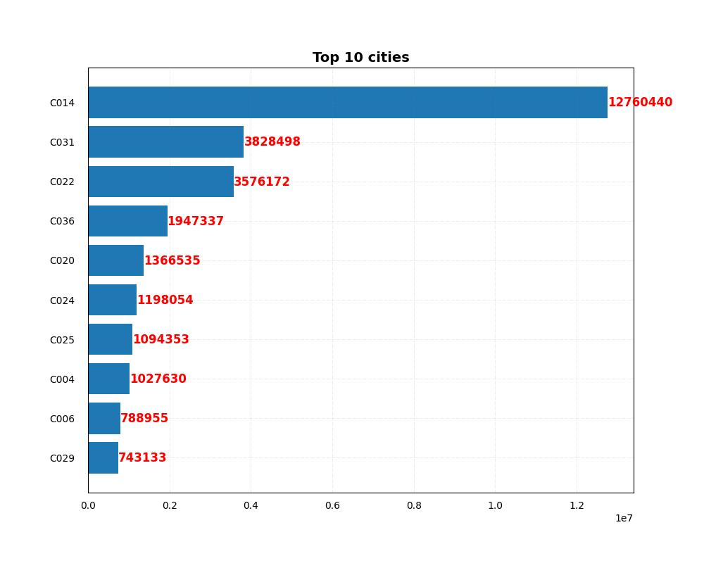
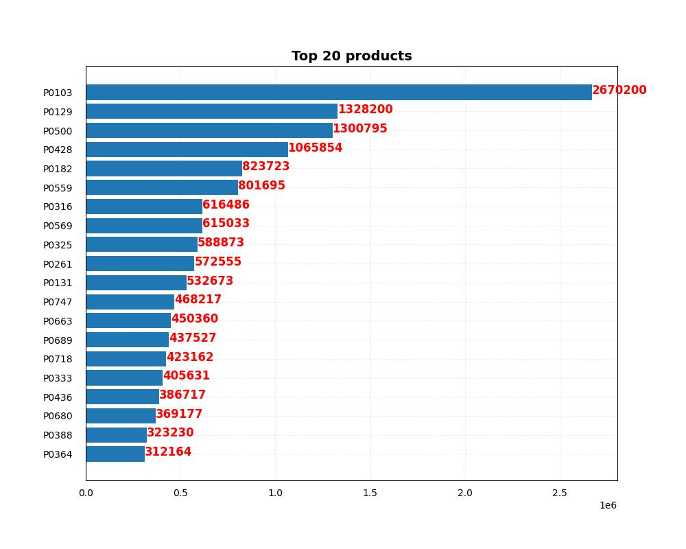

# SALES ANALYSIS

## Key Takeaway
The possibilities when SQL and Python are combined in a notebook creates a single medium where the potentials of both programming languages can be utilized

## Author
- [ChigozieObika](https://www.github.com/ChigozieObika)

## Table of Contents

  - [Business problem](#business-problem)
  - [Summary of Solution](#summary-of-solution)
  - [Data source](#data-source)
  - [Steps to Solution](#steps-to-solution)
  - [Tech Stack](#tech-stack)
  - [Summary of Results](#summary-of-results)
  - [Limitation and Recommendations](#limitation-and-recommendations)
  - [Contribution](#contribution)
  - [License](#license)

 ## [Business problem](#business-problem)
A retail outfit has sales records spanning three years, from 2017 to 2019. The outfit wants to analyze this record and make some decisions based on the results of the analysis. They are mostly interested in the performances of individual stores and of individual cities. They would also like to know their top performing stores and cities. In addition, they want some insights on the products that are the main drivers in these three years and the main drivers in each city.

## [Summary of Solution](#summary-of-solution)
The solution in this project uses SQL and python. The SQL generates most of the reports, data visualization programs running on python are used to visualize these reports.

## [Data source](#data-source)
[Retail Sales Data](https://www.kaggle.com/datasets/berkayalan/retail-sales-data)

## [Tech Stack](#tech-stack)
- Python (refer to requirement.txt for the packages used in this project)
- Psycopg2 (python SQL driver)
- Sql_alchemy (python SQL driver)
- ipython (python SQL driver)
- SQL Postgres

## [Summary of Results](#summary-of-results)

Average Revenue for each Store
| S/N | store_id | avg |
| --- | :--      | --: |
| 1 | S0001 | 3.18 |
| 2 | S0002 | 2.12 |
| 3 | S0003 | 1.90 |
| 4 | S0004 | 1.37 |
| 5 | S0005 | 1.49 |

Total Revenue by City                 City with Maximum Revenue
| S/N | city_id | sum |               | S/N | store_id | sum |
| --- | :--      | --: |              | --- | :--      | --: |
| 1 | C001 | 223137.25 |              | 1 | C014 | 12760439.56|
| 2 | C002 | 680987.33 |
| 3 | C003 | 103252.45 |
| 4 | C004 | 1027630.08 |
| 5 | C005 | 417360.83 |

Total Revenue by Store                Store with Maximum Revenue
| S/N | store_id | city_id | avg |    | S/N | store_id | city_id | sum |
| --- | :--      | :--     | --: |    | --- | :--      | :--     | --: |
| 1 | S0001 | C031 | 847042.16 |      | 1 | S0085 | C014 | 2156037.86 |
| 2 | S0002 | C007 | 494121.62 |
| 3 | S0003 | C014 | 132146.69 |
| 4 | S0004 | C022 | 174120.06 |
5    S0005    C001  108092.49

Total Revenue by Product              Product with Maximum Revenue
| S/N | product_id | sum |            | S/N | product_id | sum |
| --- | :--        | --: |            | --- | :--        | --: |
| 1 | P0001 | 21128.44 |              | 1 | P0103 | 2670199.66 |           
| 2 | P0002 | 9776.39 |
| 3 | P0004 | 1631.29 |
| 4 | P0005 | 25408.62 |
| 5 | P0006 | 2550.17 |
     

Revenue by Product in Each Store
  product_id store_id      sum
0      P0001    S0001  1616.59
1      P0001    S0002   577.25
2      P0001    S0004    66.79
3      P0001    S0008   129.45
4      P0001    S0010   234.26

Which product in which store has the maximum revenue
  product_id store_id        sum
0      P0103    S0097  278874.15

Top 10 Store by Revenue

Top 10 Cities by Revenue

Top 20 Products by Revenue

## [Limitation and Recommendations](#limitation-and-recommendations)

## [Contribution](#contribution)

Pull requests are welcome! For major changes, please open an issue first to discuss what you would like to change or contribute.

## [License](#license)

MIT License

Copyright (c) 2022 Chigozie Obika

Permission is hereby granted, free of charge, to any person obtaining a copy
of this software and associated documentation files (the "Software"), to deal
in the Software without restriction, including without limitation the rights
to use, copy, modify, merge, publish, distribute, sublicense, and/or sell
copies of the Software, and to permit persons to whom the Software is
furnished to do so, subject to the following conditions:

The above copyright notice and this permission notice shall be included in all
copies or substantial portions of the Software.

THE SOFTWARE IS PROVIDED "AS IS", WITHOUT WARRANTY OF ANY KIND, EXPRESS OR
IMPLIED, INCLUDING BUT NOT LIMITED TO THE WARRANTIES OF MERCHANTABILITY,
FITNESS FOR A PARTICULAR PURPOSE AND NONINFRINGEMENT. IN NO EVENT SHALL THE
AUTHORS OR COPYRIGHT HOLDERS BE LIABLE FOR ANY CLAIM, DAMAGES OR OTHER
LIABILITY, WHETHER IN AN ACTION OF CONTRACT, TORT OR OTHERWISE, ARISING FROM,
OUT OF OR IN CONNECTION WITH THE SOFTWARE OR THE USE OR OTHER DEALINGS IN THE
SOFTWARE.

Learn more about [MIT](https://choosealicense.com/licenses/mit/) license

